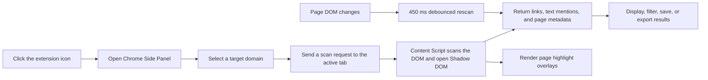

# Backlink Inspector

**English** | [简体中文](./README.md)

> Documentation for v1.0.1, updated on 2026-09-26.

Backlink Inspector is a local-first Chrome Manifest V3 extension for inspecting links and plain-text domain mentions on the current page. It runs in the Chrome Side Panel and reports link attributes, placement, visibility, redirect clues, and page-level SEO metadata for user-managed target domains.


## Table of Contents

- [Highlights](#highlights)
- [How It Works](#how-it-works)
- [Requirements](#requirements)
- [Technology Stack](#technology-stack)
- [Installation](#installation)
- [Usage](#usage)
- [Scanning Rules](#scanning-rules)
- [Permissions](#permissions)
- [Data and Privacy](#data-and-privacy)
- [Project Structure](#project-structure)
- [Development](#development)
- [Testing and Quality Checks](#testing-and-quality-checks)
- [Build and Packaging](#build-and-packaging)
- [Limitations and Notes](#limitations-and-notes)
- [Troubleshooting](#troubleshooting)
- [Contributing](#contributing)
- [License](#license)

## Highlights

- Uses the Chrome Side Panel so scan controls and results remain visible beside the inspected page.
- Matches regular links, image links, and plain-text mentions of a target domain.
- Optionally includes subdomains in matching.
- Detects targets embedded in common redirect parameters such as `url`, `target`, `dest`, `redirect`, and `out`.
- Classifies `follow`, `nofollow`, `ugc`, and `sponsored` links.
- Reports anchor text, destination URL, image `alt`, context, visibility, and `target="_blank"` state.
- Estimates whether a match is in article content, comments, navigation, a sidebar, a footer, or generic page content.
- Reads page-level `noindex`, `nofollow`, and canonical metadata.
- Draws non-destructive page overlays with smooth location scrolling and animated numbered badges.
- Scans open Shadow DOM roots.
- Debounces and reruns scans after relevant DOM changes on dynamic pages and common SPAs.
- Supports bulk domain entry, individual deletion, and persistence of the last selected domain.
- Stores saved findings locally and exports scan results as JSON or CSV.

## How It Works



The extension has three main runtime layers:

1. `background.ts` opens the Side Panel, validates page access, and makes sure the scanner is injected.
2. `content.ts` scans links, text nodes, and metadata in the page context, and manages highlights and dynamic rescans.
3. The React Side Panel manages target domains, result filters, local saved records, and file exports.

## Requirements

- Google Chrome 114 or newer.
- Node.js 22 or newer for development.
- pnpm 10; the repository declares `pnpm@10.23.0`.
- Chrome is the primary browser target. A Firefox development script exists, but the current implementation depends on `chrome.sidePanel` and does not claim complete Firefox compatibility.

## Technology Stack

| Category | Technology |
| --- | --- |
| Extension framework | WXT 0.21.4 and Chrome Manifest V3 |
| UI | React 19.3, Tailwind CSS 4.3, and Lucide React |
| Language | TypeScript 5.9 with strict mode and `noUncheckedIndexedAccess` |
| Build | Vite 8 and pnpm 10 |
| Tests | Vitest 5 |
| Chrome APIs | `action`, `sidePanel`, `scripting`, `tabs`, `runtime`, and `storage.local` |

## Installation

### Install from Source

Clone the repository and install dependencies:

```bash
git clone https://github.com/MattCraftsCode/backlink-inspector.git
cd backlink-inspector
corepack enable
pnpm install
```

Create a production build:

```bash
pnpm build
```

Load it in Chrome:

1. Open `chrome://extensions`.
2. Enable **Developer mode**.
3. Click **Load unpacked**.
4. Select `.output/chrome-mv3` from this project.
5. Pin Backlink Inspector to the browser toolbar for easier access.

### Install or Publish a ZIP Package

Run:

```bash
pnpm zip
```

WXT creates a package similar to:

```text
.output/backlink-inspector-<version>-chrome.zip
```

The ZIP can be uploaded to the Chrome Web Store. For local testing, unzip it first and load the extracted directory through `chrome://extensions`; Chrome Developer Mode does not load ZIP files directly.

## Usage

### 1. Open an Inspectable Page

Open a regular `http://` or `https://` page, then click the Backlink Inspector toolbar icon. The Side Panel opens next to the active tab.

### 2. Add Target Domains

There are no preset domains on first use:

1. Click the manage button next to Target domain.
2. Enter one domain per line.
3. You can enter `example.com` or a full URL. Full URLs are normalized and stored as hostnames.
4. Click `Save domains`.

Duplicates are removed automatically. Existing domains appear below the input and can be deleted individually.

### 3. Choose the Matching Scope

- Enable `Include subdomains` to make `example.com` match `docs.example.com`.
- Disable it to match only the root hostname `example.com`.

The last selected target domain is stored locally and restored the next time the extension opens.

### 4. Scan the Current Page

Click `Scan current page`. The summary shows:

- Matches: all detected items.
- Links: clickable links.
- Follow: links without `nofollow`, `ugc`, or `sponsored`.
- Text only: plain-text domain mentions.

If no domain has been added, the extension displays `Please add a target domain first.`.

### 5. Inspect and Act on Results

Each result supports:

- `Locate`: smoothly scroll to the page element and play the location animation.
- `Copy`: copy the destination URL or text mention.
- External-link button: open the destination in a new tab.
- `Save`: save or remove the finding from local saved records.

Results can be filtered by Links, Follow, Nofollow, UGC, Sponsored, Text, Hidden, and Redirect.

### 6. Clear Highlights

Click the eraser button beside the scan button to remove page overlays. This does not delete scan results or saved records.

### 7. Export Data

Open the `...` menu in the top-right corner of the Side Panel:

- `Export JSON` exports metadata, the target, and complete scan results.
- `Export CSV` exports tabular scan data.
- `Clear saved records` removes locally saved findings.

## Scanning Rules

### Domain Normalization

- Hostnames are converted to lowercase.
- A leading `www.` is removed.
- A trailing hostname dot is removed.
- Inputs must represent valid HTTP/HTTPS hostnames and contain a dot.

### Link Matching

The extension scans `a[href]` elements in every accessible root, including open Shadow DOM roots.

Collected fields include:

- Resolved `href`.
- Raw `href` attribute.
- Anchor text or image `alt` text.
- `nofollow`, `ugc`, `sponsored`, `noopener`, and `noreferrer` flags.
- External-link, new-tab, and visibility state.
- Up to 280 characters of nearby context.

### Redirect Parameter Detection

The extension checks these common query parameters:

```text
url, u, target, dest, destination, redirect,
redirect_url, redirect_uri, to, out
```

This is static parameter analysis. The extension does not send network requests or follow server-side HTTP redirects.

### Plain-Text Mentions

A DOM TreeWalker searches for domain text outside links, scripts, styles, form controls, and editable elements. A single scan returns at most 200 plain-text matches.

### Visibility Detection

A result is considered hidden when it has any of the following conditions:

- `display: none`
- `visibility: hidden`
- `opacity: 0`
- An ancestor with `[hidden]` or `[aria-hidden="true"]`
- No visible layout rectangles

### Dynamic Pages

After the first manual scan, a MutationObserver watches relevant node, attribute, and text changes. Changes trigger a 450 ms debounced rescan and send refreshed results to the Side Panel.

## Permissions

| Permission | Purpose |
| --- | --- |
| `sidePanel` | Displays controls and scan results beside the active page. |
| `scripting` | Ensures the packaged scanner is available in an inspectable tab. |
| `storage` | Stores target domains, the last selection, saved records, and migration state locally. |
| `http://*/*`, `https://*/*` | Allows users to inspect arbitrary regular HTTP/HTTPS websites. |

The broad host permissions are required because the extension cannot know in advance which backlink source pages a user needs to inspect.

## Data and Privacy

- Scanning runs inside the user's browser.
- The current codebase does not include a backend service, analytics SDK, advertising SDK, or remote code loading.
- Page DOM, link, and text content is not uploaded by the extension to an external server.
- Target domains, the last selected domain, and saved findings are stored in `chrome.storage.local`.
- Saved findings are limited to 500 records.
- JSON and CSV files are generated only after an explicit user export and are downloaded locally by the browser.
- Opening a result destination performs a normal browser navigation to that website.

Before publishing to the Chrome Web Store, provide a public privacy policy that matches the actual behavior and accurately disclose local processing of website content and the active page URL.

## Project Structure

```text
backlink-inspector/
├── components/
│   ├── DomainManagerDialog.tsx  # Bulk add and individual deletion
│   └── DomainSelect.tsx         # Custom domain listbox
├── core/
│   ├── badge-position.ts        # Dynamic numbered-badge placement
│   ├── domain-list.ts           # Multiline parsing and deduplication
│   ├── domain-matcher.ts        # Domain, URL, and redirect matching
│   └── page-access.ts           # Restricted-page classification
├── docs/images/
│   └── backlink-inspector-overview.png
├── entrypoints/
│   ├── background.ts            # Service Worker and Side Panel orchestration
│   ├── content.ts               # DOM scanning, rescans, and overlays
│   └── sidepanel/
│       ├── App.tsx              # Main Side Panel application
│       ├── index.html
│       ├── main.tsx
│       └── styles.css
├── public/                      # Chrome extension icons
├── shared/                      # Message contracts and shared types
├── storage/                     # chrome.storage.local repository
├── package.json
├── wxt.config.ts                # WXT and Manifest configuration
├── README.md                    # Chinese documentation
└── README.en.md                 # English documentation
```

## Development

Install dependencies:

```bash
corepack enable
pnpm install
```

If generated `.wxt` types are missing, run:

```bash
pnpm prepare
```

Start Chrome development mode:

```bash
pnpm dev
```

WXT starts a development build with hot updates. If Background or Content Script changes do not appear, reload the extension in `chrome://extensions` and refresh the target page.

The repository also provides:

```bash
pnpm dev:firefox
```

This command only exposes WXT's Firefox build workflow. It does not mean the current `chrome.sidePanel` implementation has complete Firefox support.

## Testing and Quality Checks

Run TypeScript checks:

```bash
pnpm typecheck
```

Run unit tests:

```bash
pnpm test
```

The current tests cover:

- Root-domain and optional subdomain matching.
- Exact URL and common redirect-parameter matching.
- Multiline domain normalization, deduplication, and invalid input.
- Chrome internal and Chrome Web Store access restrictions.
- Numbered highlight badge placement near viewport edges.
- Empty initial domain state, legacy seed cleanup, and last-selection persistence.

## Build and Packaging

Create the production directory:

```bash
pnpm build
```

Output:

```text
.output/chrome-mv3/
```

Create a Chrome Web Store upload package:

```bash
pnpm zip
```

Before releasing a new version, update the version in `package.json`, then run:

```bash
pnpm typecheck
pnpm test
pnpm zip
```

Do not commit `.output`, `.wxt`, or `node_modules`; they are excluded by `.gitignore`.

## Limitations and Notes

- Only regular HTTP/HTTPS pages are inspectable.
- Chrome Web Store, `chrome://`, `chrome-extension://`, `devtools://`, `edge://`, `about:`, and `view-source:` pages cannot be scanned.
- Local `file://` pages are not enabled by default.
- The current scanner operates in the top-level document and does not scan iframe contents.
- Open Shadow DOM is supported; closed Shadow DOM is inaccessible.
- Redirect detection analyzes query parameters only and does not perform remote requests or resolve server redirects.
- Placement classification is heuristic and depends on semantic elements, ARIA roles, class names, and IDs.
- Visibility checks use computed styles and layout rectangles; they are not full visual occlusion tests.
- Content Scripts must be reloaded into target pages. After updating the extension, refresh already-open pages.
- Results describe the current DOM, not the final behavior of a search engine crawler or indexer.

## Troubleshooting

### The Current Page Cannot Be Inspected

Make sure the active tab is a regular HTTP/HTTPS page. Browser internal pages, extension pages, and Chrome Web Store pages block extension script injection by design.

### The Tab Has Not Granted Page Access

Keep the target page active and click the Backlink Inspector toolbar icon. If the extension was just updated or reloaded, refresh the target page as well.

### Expected Links Are Missing

Check the following:

1. The selected Target domain is correct.
2. The target is on a subdomain and `Include subdomains` is enabled when required.
3. The content is not inside an iframe or closed Shadow DOM.
4. The destination is present in a scannable `href`, rather than being created only by click JavaScript or a server redirect.
5. The page did not finish asynchronous rendering after the scan; wait for it to load and scan again.

### UI Changes Do Not Appear

Reload the extension from `chrome://extensions`, refresh the target tab, and click the extension icon again.

### Clear All Local Data

Removing the extension from `chrome://extensions` deletes its local extension storage. During development, `chrome.storage.local` can also be cleared from the extension Service Worker DevTools.

## Contributing

Before submitting changes, run:

```bash
pnpm typecheck
pnpm test
```

When opening an issue, include:

- Chrome version and operating system.
- The page type or a minimal HTML reproduction.
- Target domain and `Include subdomains` setting.
- The Side Panel error message.
- A screenshot when useful, without exposing sensitive page content.

Report project issues through [GitHub Issues](https://github.com/MattCraftsCode/backlink-inspector/issues).

## License

This repository currently does not include a `LICENSE` file. Do not assume that the project is licensed under MIT, Apache-2.0, or another open-source license unless the repository owner grants that permission. Contact the maintainer before using, distributing, or modifying the project outside the permissions implied by repository access.
