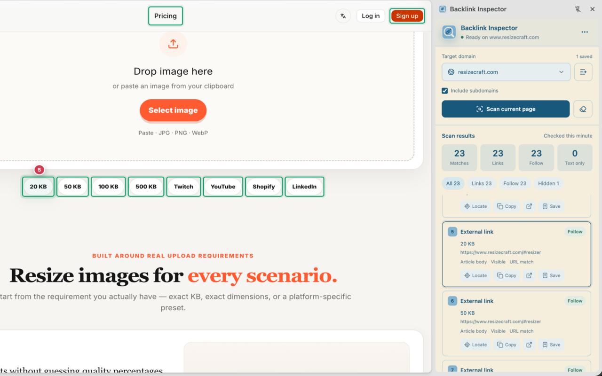
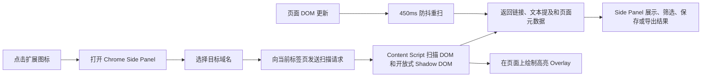

# Backlink Inspector

[English](./README.en.md) | **简体中文**

> 文档对应版本：v1.0.1，更新于 2026-09-26。

Backlink Inspector 是一个基于 Chrome Manifest V3 的本地化反向链接检查扩展。它通过 Chrome Side Panel 扫描当前网页，查找指向指定域名的链接和纯文本域名提及，并展示链接属性、页面位置、可见性、重定向线索以及页面级 SEO 元数据。



## 目录

- [核心能力](#核心能力)
- [工作原理](#工作原理)
- [运行环境](#运行环境)
- [技术栈](#技术栈)
- [安装](#安装)
- [使用方法](#使用方法)
- [扫描规则](#扫描规则)
- [权限说明](#权限说明)
- [数据与隐私](#数据与隐私)
- [项目结构](#项目结构)
- [本地开发](#本地开发)
- [测试与质量检查](#测试与质量检查)
- [构建与打包](#构建与打包)
- [限制与注意事项](#限制与注意事项)
- [常见问题](#常见问题)
- [参与开发](#参与开发)
- [许可证](#许可证)

## 核心能力

- 使用 Chrome Side Panel 展示扫描控制项和结果，不遮挡主页面内容。
- 按域名匹配普通链接、图片链接和纯文本域名提及。
- 可选择是否匹配目标域名的子域名。
- 识别常见跳转参数中的目标地址，例如 `url`、`target`、`dest`、`redirect` 和 `out`。
- 分类 `follow`、`nofollow`、`ugc` 和 `sponsored` 链接。
- 显示锚文本、目标 URL、图片 `alt`、上下文、可见性和 `target="_blank"` 等信息。
- 判断匹配项位于正文、评论、导航、侧栏、页脚或普通页面内容中。
- 检查页面 `noindex`、页面级 `nofollow` 和 canonical URL。
- 在原页面上添加非侵入式高亮框，并支持平滑定位和动态编号徽标。
- 扫描开放式 Shadow DOM。
- 页面 DOM 更新后自动进行防抖重扫，适用于常见 SPA 和动态加载页面。
- 批量添加和删除目标域名，并记住用户上次选择的域名。
- 将结果保存到浏览器本地，支持 JSON 和 CSV 导出。

## 工作原理



扩展由三个主要部分组成：

1. `background.ts` 负责打开 Side Panel、判断页面是否允许访问，并确保扫描脚本已注入。
2. `content.ts` 在页面上下文中扫描链接、文本节点和元数据，同时管理定位高亮与动态重扫。
3. Side Panel React 应用负责域名管理、结果筛选、本地收藏和文件导出。

## 运行环境

- Google Chrome 114 或更高版本。
- 开发环境需要 Node.js 22 或更高版本。
- 项目使用 pnpm 10，仓库声明的版本为 `pnpm@10.23.0`。
- 主要开发目标是 Chrome。仓库包含 Firefox 开发脚本，但当前实现依赖 `chrome.sidePanel`，未声明完整 Firefox 兼容性。

## 技术栈

| 类别 | 技术 |
| --- | --- |
| 扩展框架 | WXT 0.21.4、Chrome Manifest V3 |
| 界面 | React 19.3、Tailwind CSS 4.3、Lucide React |
| 语言 | TypeScript 5.9，启用严格模式和 `noUncheckedIndexedAccess` |
| 构建 | Vite 8、pnpm 10 |
| 测试 | Vitest 5 |
| Chrome API | `action`、`sidePanel`、`scripting`、`tabs`、`runtime`、`storage.local` |

## 安装

### 从源码安装

克隆仓库并安装依赖：

```bash
git clone https://github.com/MattCraftsCode/backlink-inspector.git
cd backlink-inspector
corepack enable
pnpm install
```

生成生产构建：

```bash
pnpm build
```

在 Chrome 中加载：

1. 打开 `chrome://extensions`。
2. 开启右上角的“开发者模式”。
3. 点击“加载已解压的扩展程序”。
4. 选择项目中的 `.output/chrome-mv3` 目录。
5. 建议将 Backlink Inspector 固定到浏览器工具栏。

### 使用 ZIP 包安装或发布

执行：

```bash
pnpm zip
```

WXT 会在 `.output` 中生成类似下面的文件：

```text
.output/backlink-inspector-<version>-chrome.zip
```

该 ZIP 可用于上传 Chrome Web Store。若用于本地测试，需要先解压，再通过 `chrome://extensions` 加载解压后的目录；Chrome 开发者模式不能直接加载 ZIP。

## 使用方法

### 1. 打开可扫描页面

打开一个普通的 `http://` 或 `https://` 网页，然后点击浏览器工具栏中的 Backlink Inspector 图标。扩展会在当前标签页右侧打开 Side Panel。

### 2. 添加目标域名

首次使用时没有任何预设域名：

1. 点击 Target domain 右侧的管理按钮。
2. 在文本框中输入域名，每行一个。
3. 可以输入 `example.com`，也可以输入完整 URL；完整 URL 会被规范化并保存为域名。
4. 点击 `Save domains`。

重复项会自动去除。已保存域名会显示在管理弹窗下方，可逐条删除。

### 3. 选择扫描范围

- 开启 `Include subdomains`：`example.com` 也会匹配 `docs.example.com`。
- 关闭该选项：只匹配根域名 `example.com`。

用户上次选择的目标域名会保存在浏览器本地，下次打开扩展时自动恢复。

### 4. 扫描当前页面

点击 `Scan current page`。扫描完成后会显示：

- Matches：全部匹配项。
- Links：可点击链接。
- Follow：未标记 `nofollow`、`ugc` 或 `sponsored` 的链接。
- Text only：页面中的纯文本域名提及。

如果尚未添加域名，界面会提示 `Please add a target domain first.`。

### 5. 查看和操作结果

每条结果支持：

- `Locate`：平滑滚动到对应页面元素并播放定位动画。
- `Copy`：复制目标 URL 或文本提及。
- 外链按钮：在新标签页中打开目标 URL。
- `Save`：保存或取消保存当前结果。

结果可按 Links、Follow、Nofollow、UGC、Sponsored、Text、Hidden 和 Redirect 进行筛选。

### 6. 清除高亮

点击扫描按钮右侧的橡皮擦图标即可删除页面上的高亮 Overlay。该操作不会删除扫描结果或已保存记录。

### 7. 导出数据

点击 Side Panel 右上角的 `...` 菜单：

- `Export JSON`：导出页面元数据、目标域名和完整扫描结果。
- `Export CSV`：导出适合表格软件处理的扫描数据。
- `Clear saved records`：清除浏览器本地保存的结果记录。

## 扫描规则

### 域名规范化

- 域名统一转换为小写。
- 自动移除开头的 `www.`。
- 自动移除域名末尾的点。
- 输入必须是合法的 HTTP/HTTPS 域名，并且主机名中需要包含点。

### 链接匹配

扩展扫描所有可访问根节点中的 `a[href]` 元素，包括开放式 Shadow DOM 中的链接。

匹配结果包含：

- 实际解析后的 `href`。
- 原始 `href` 属性。
- 锚文本或图片 `alt`。
- `nofollow`、`ugc`、`sponsored`、`noopener` 和 `noreferrer`。
- 是否外链、是否新窗口打开以及是否可见。
- 最多 280 个字符的上下文文本。

### 重定向参数识别

扩展会检查以下常见查询参数：

```text
url, u, target, dest, destination, redirect,
redirect_url, redirect_uri, to, out
```

这是静态参数识别，不会发起网络请求，也不会跟随服务端 HTTP 重定向。

### 纯文本提及

扩展使用 DOM TreeWalker 查找不位于链接、脚本、样式、表单控件或可编辑元素中的域名文本。单次扫描最多返回 200 条纯文本匹配。

### 可见性判断

以下情况会被视为隐藏：

- `display: none`
- `visibility: hidden`
- `opacity: 0`
- 位于 `[hidden]` 或 `[aria-hidden="true"]` 内
- 没有可见布局矩形

### 动态页面

首次手动扫描后，MutationObserver 会监控 DOM 的节点、属性和文本变化。相关变化会触发 450ms 防抖重扫，并把最新结果发送到 Side Panel。

## 权限说明

| 权限 | 用途 |
| --- | --- |
| `sidePanel` | 在当前标签页右侧展示扫描界面和结果。 |
| `scripting` | 在允许访问的标签页中确保扫描脚本已注入。 |
| `storage` | 本地保存目标域名、最后选择、收藏记录和迁移状态。 |
| `http://*/*`、`https://*/*` | 支持用户检查任意普通 HTTP/HTTPS 网站。 |

扩展声明较宽的 Host Permissions，是因为目标页面和需要检查的反向链接来源站点无法预先确定。

## 数据与隐私

- 扫描逻辑在用户浏览器中运行。
- 当前代码不包含后端服务、分析 SDK、广告 SDK 或远程代码加载。
- 页面 DOM、链接和文本内容不会由扩展上传到外部服务器。
- 目标域名、最后选择的域名和收藏记录保存在 `chrome.storage.local`。
- 收藏记录最多保留 500 条。
- JSON 和 CSV 只在用户主动导出时生成，并由浏览器下载到本地。
- 点击结果中的外链按钮会正常访问该目标网站，该网络请求由浏览器页面导航产生。

在发布到 Chrome Web Store 前，仍应提供与实际行为一致的公开隐私政策，并如实披露网页内容和当前页面 URL 的本地处理行为。

## 项目结构

```text
backlink-inspector/
├── components/
│   ├── DomainManagerDialog.tsx  # 域名批量添加和删除
│   └── DomainSelect.tsx         # 自定义域名下拉框
├── core/
│   ├── badge-position.ts        # 定位徽标的动态方向计算
│   ├── domain-list.ts           # 多行域名解析与去重
│   ├── domain-matcher.ts        # 域名、URL 和跳转参数匹配
│   └── page-access.ts           # 页面访问限制判断
├── docs/images/
│   └── backlink-inspector-overview.png
├── entrypoints/
│   ├── background.ts            # Service Worker 与 Side Panel 调度
│   ├── content.ts               # DOM 扫描、动态重扫和页面高亮
│   └── sidepanel/
│       ├── App.tsx              # Side Panel 主应用
│       ├── index.html
│       ├── main.tsx
│       └── styles.css
├── public/                      # Chrome 扩展图标
├── shared/                      # 消息协议和共享类型
├── storage/                     # chrome.storage.local 数据访问
├── package.json
├── wxt.config.ts                # WXT 与 Manifest 配置
├── README.md                    # 中文文档
└── README.en.md                 # 英文文档
```

## 本地开发

安装依赖：

```bash
corepack enable
pnpm install
```

如果 `.wxt` 类型文件缺失，执行：

```bash
pnpm prepare
```

启动 Chrome 开发模式：

```bash
pnpm dev
```

WXT 会启动开发构建和热更新。修改 Background 或 Content Script 后，如果行为没有更新，请在 `chrome://extensions` 中重新加载扩展并刷新目标网页。

仓库还提供：

```bash
pnpm dev:firefox
```

该命令仅表示 WXT 可以启动 Firefox 构建流程，不代表当前 `chrome.sidePanel` 功能已经完成 Firefox 适配。

## 测试与质量检查

类型检查：

```bash
pnpm typecheck
```

运行单元测试：

```bash
pnpm test
```

当前测试覆盖：

- 域名和子域名匹配。
- 精确 URL 与常见跳转参数识别。
- 多行域名规范化、去重和无效输入。
- Chrome 内部页面和 Web Store 页面限制。
- 高亮编号徽标的边界位置计算。
- 初始域名为空、旧预设迁移清理和最后选择持久化。

## 构建与打包

生成生产目录：

```bash
pnpm build
```

输出目录：

```text
.output/chrome-mv3/
```

生成 Chrome Web Store 上传包：

```bash
pnpm zip
```

发布新版本前应更新 `package.json` 中的版本号，并依次执行：

```bash
pnpm typecheck
pnpm test
pnpm zip
```

不要把 `.output`、`.wxt` 或 `node_modules` 提交到 Git，它们已经在 `.gitignore` 中排除。

## 限制与注意事项

- 只能扫描普通 HTTP/HTTPS 页面。
- Chrome Web Store、`chrome://`、`chrome-extension://`、`devtools://`、`edge://`、`about:` 和 `view-source:` 页面无法扫描。
- 默认不允许扫描 `file://` 本地文件。
- 当前仅扫描顶层文档，不扫描 iframe 内部内容。
- 只能进入开放式 Shadow DOM，无法访问闭合 Shadow DOM。
- 重定向检测只分析 URL 查询参数，不执行远程请求或服务端跳转解析。
- 页面位置分类依赖语义标签、ARIA role、class 和 id 关键字，因此是启发式判断。
- 可见性检测基于当前计算样式和布局矩形，不等同于完整的视觉遮挡检测。
- Content Script 必须在目标页面中重新加载。更新扩展后，已打开的网页通常也需要刷新。
- 扫描结果代表当前 DOM 状态，不代表搜索引擎最终抓取或索引结果。

## 常见问题

### 提示无法检查当前页面

确认当前标签页是普通 HTTP/HTTPS 页面。Chrome 内部页面、扩展页面和 Chrome Web Store 页面受浏览器安全限制，扩展不能向其中注入扫描脚本。

### 提示页面没有授权访问

保持目标网页为当前活动标签页，点击 Backlink Inspector 工具栏图标。如果刚更新或重新加载了扩展，请同时刷新目标网页。

### 扫描不到预期链接

检查：

1. Target domain 是否正确。
2. 目标是否位于子域名，是否需要开启 `Include subdomains`。
3. 内容是否位于 iframe 或闭合 Shadow DOM。
4. 链接是否通过脚本点击或服务端重定向产生，而不是出现在可扫描的 `href` 中。
5. 页面是否在扫描后才完成异步加载；可等待加载完成后重新扫描。

### 修改代码后界面没有更新

在 `chrome://extensions` 中点击扩展的重新加载按钮，然后刷新目标标签页并重新点击扩展图标。

### 如何彻底清除本地数据

在 `chrome://extensions` 中移除扩展会删除该扩展对应的本地存储。开发调试时也可以通过扩展 Service Worker 的 DevTools 清理 `chrome.storage.local`。

## 参与开发

提交修改前建议执行：

```bash
pnpm typecheck
pnpm test
```

提交 Issue 时请附上：

- Chrome 版本和操作系统。
- 可复现页面类型或最小 HTML 示例。
- 目标域名和 `Include subdomains` 设置。
- Side Panel 错误信息。
- 必要时提供截图，但不要包含敏感网页内容。

项目问题可提交到 [GitHub Issues](https://github.com/MattCraftsCode/backlink-inspector/issues)。

## 许可证

当前仓库没有包含 `LICENSE` 文件。除非仓库所有者另行授权，否则不要假定本项目采用 MIT、Apache-2.0 或其他开源许可证。使用、分发或修改前请联系项目维护者确认授权范围。
